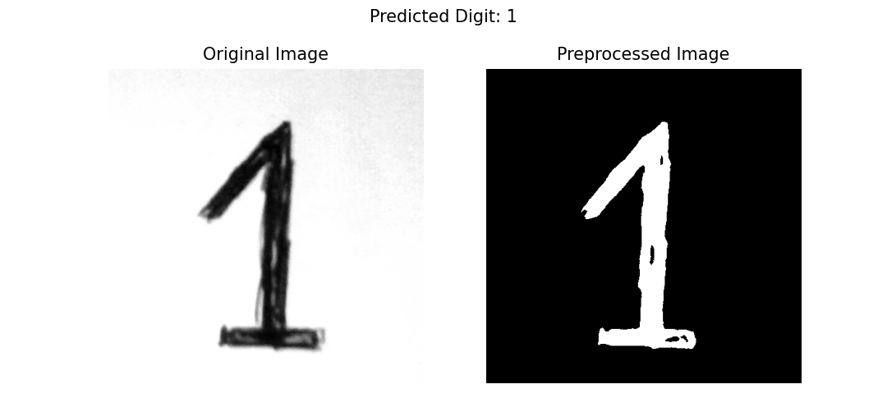

# Digit Recognition - MNIST with PyTorch

This repository contains a PyTorch-based implementation of a Convolutional Neural Network (CNN) for MNIST digit classification. The project includes training, validating, and prediction option, along with visualization tools for evaluating model performance.

---

## Project Structure

```
.
├── train_model.py         # Script for training the CNN model
├── test_model.py          # Script for testing the model with custom images
├── requirements.txt       # Python dependencies for the project
├── plots                  # Folder to store plots for metrics (e.g., loss, accuracy)
├── images to test         # Folder for user-uploaded digit images for prediction
```

---

## Getting Started

### 1. Prerequisites

- Python >= 3.8
- PyTorch >= 1.10
- torchvision
- matplotlib
- numpy
- seaborn
- tqdm
- Pillow
- scikit-learn

### 2. Installation

1. Clone the repository:
   ```bash
   git clone https://github.com/Anthony-Aoun/Digit-Recognition
   cd Digit-Recognition
   ```

2. Install dependencies:
   ```bash
   pip install -r requirements.txt
   ```

---

## Training the Model

1. Modify the hyperparameters in `train_model.py` as needed (e.g., `batch_size`, `num_epochs`, `learning_rate`, etc.).
2. Run the training script:
   ```bash
   python train_model.py
   ```

The script will:
- Train the model on the MNIST dataset (with or without a validation split based on `train_mode`).
- Generate training and validation metrics (loss and accuracy).
- Generate the confusion matrix.
- Generate the trained model as `cnn_mnist_model.pth`.

---

## Testing the Model with Custom Images

1. Add digit images to the `images to test` folder. Images can be in `.png`, `.jpg`, or `.jpeg` format.
2. Run the testing script:
   ```bash
   python test_model.py
   ```

The script will:
- Process each image in the `images to test` folder.
- Predict the digit using the trained model.
- Display the original and processed images along with the predicted digit.

---

## Results and Visualization

### 1. Training and Validation Metrics
- Loss and accuracy plots are saved in the `plots` folder as `loss_accuracy_plot.png`.

### 2. Confusion Matrix
- The confusion matrix for the test dataset is saved in the `plots` folder as `confusion_matrix.png`.

### 3. Prediction Results
- Predictions for custom images are displayed as matplotlib plots with the original and preprocessed image alongside the predicted digit.
- Here is an example of prediction. It is a '1' digit I personally drew and placed in the `images to test` folder:



---

## Model Details

### CNN Architecture
1. **Convolutional Layers**:
   - `conv1`: 32 filters, kernel size = 3
   - `conv2`: 64 filters, kernel size = 3
   - `conv3`: 128 filters, kernel size = 3

2. **Fully Connected Layers**:
   - `fc1`: 1024 units
   - `fc2`: 10 units (for MNIST classes)

3. **Dropouts**:
   - Dropout = 0.5

4. **Regularization**:
   - Adam optimizer with L2 regularization (`weight_decay` = 1e-5)

5. **Learning Rate Scheduler**:
   - Reduce learning rate on plateau (training loss stagnation).

---

## Notes

- To train on 80% of the dataset and leave 20% for validation, set `train_mode = True` in `train_model.py`.
- To train on 100% of the dataset without validation, set `train_mode = False` in `train_model.py`.
- Ensure the `images to test` folder contains grayscale-like digit images for accurate predictions.

---


## Acknowledgments

- [PyTorch Documentation](https://pytorch.org/docs/)
- [MNIST Dataset](http://yann.lecun.com/exdb/mnist/)

## License
This project is licensed under the MIT License.

## Author
© 2025 [Anthony Aoun](https://github.com/Anthony-Aoun). All rights reserved.

This project is open-source and free to use for educational purpouses only.
